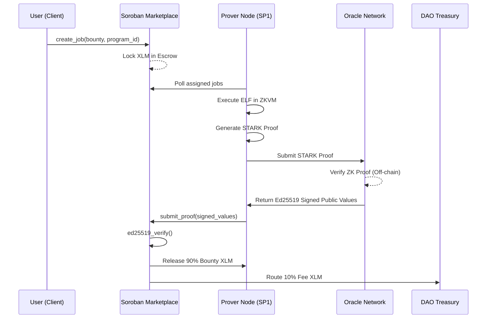

# Sadgi Protocol Architecture

The Sadgi Protocol bridges computationally expensive generic compute (via SP1 RISC-V zero-knowledge proofs) with the Stellar network through Soroban smart contracts.

## High-Level Flow

## Core Components

1. **Soroban Marketplace (`sadgi-marketplace`)**: Handles O(1) indexed job queues, manages escrow token locking, and coordinates deadlines. Uses `token::Client` to execute native transfers.
2. **Oracle Bridge (`sadgi-verifier`)**: Because native `bn254` pairing is not yet supported in Soroban, this uses `env.crypto().ed25519_verify()` to validate signatures provided by a trusted ZK oracle.
3. **Registry (`sadgi-registry`)**: Maintains verified Program ELFs and a **Trusted Issuers Merkle Root** for Verifiable Credentials DID.
4. **SP1 Node (`sadgi-prover-node`)**: Rust daemon integrating the `sp1-sdk` to execute RISC-V programs, generate cryptographic proofs, and wrap them with Oracle signatures before submission.
