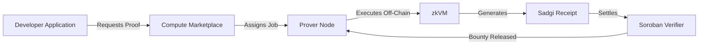

# Introduction to Sadgi

Sadgi is **The Verifiable Compute Protocol for Stellar**.

Our mission is to enable developers to build privacy-preserving, trustless applications without requiring deep expertise in zero-knowledge cryptography.

## Why Sadgi?
Blockchain consensus is notoriously bad at handling heavy computation or private data. If you want to verify a user's age via their passport (KYC) without revealing their birthdate on a public ledger, or if you want to verify the output of a heavy AI model, you cannot do this natively in a Smart Contract.

Sadgi bridges this gap. 
Developers write complex rust programs and execute them off-chain inside a **Zero-Knowledge Virtual Machine (zkVM)**. The result is a mathematically sound **Receipt** that can be cheaply verified on-chain via our Soroban smart contracts.

